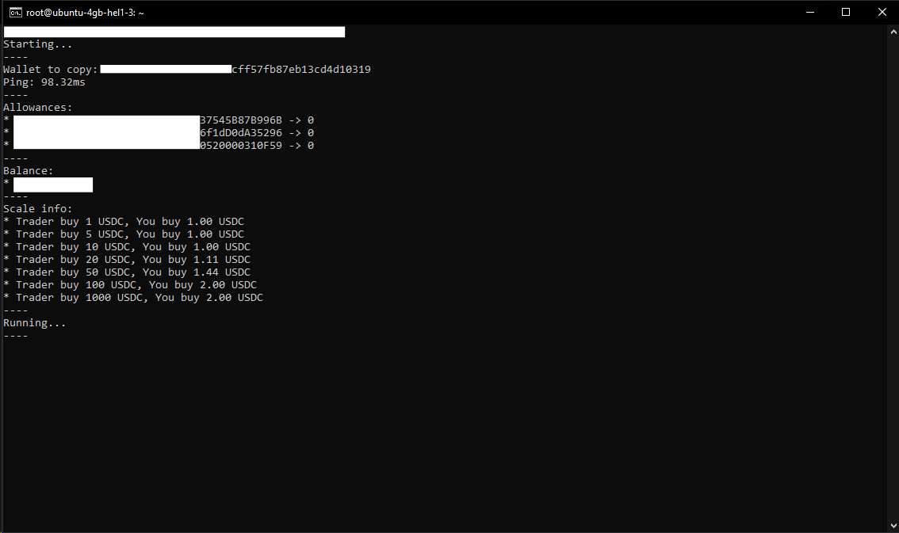
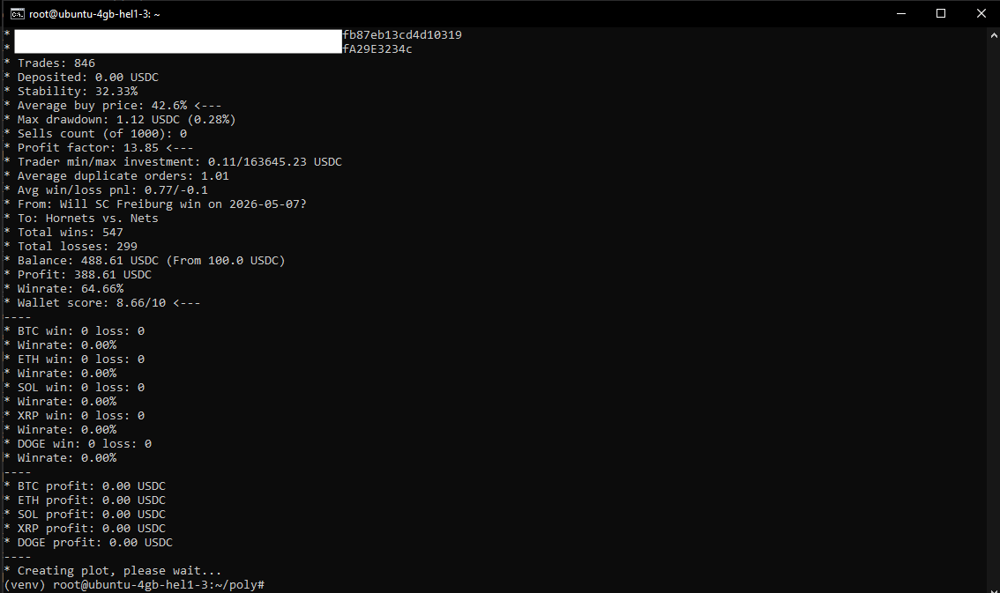
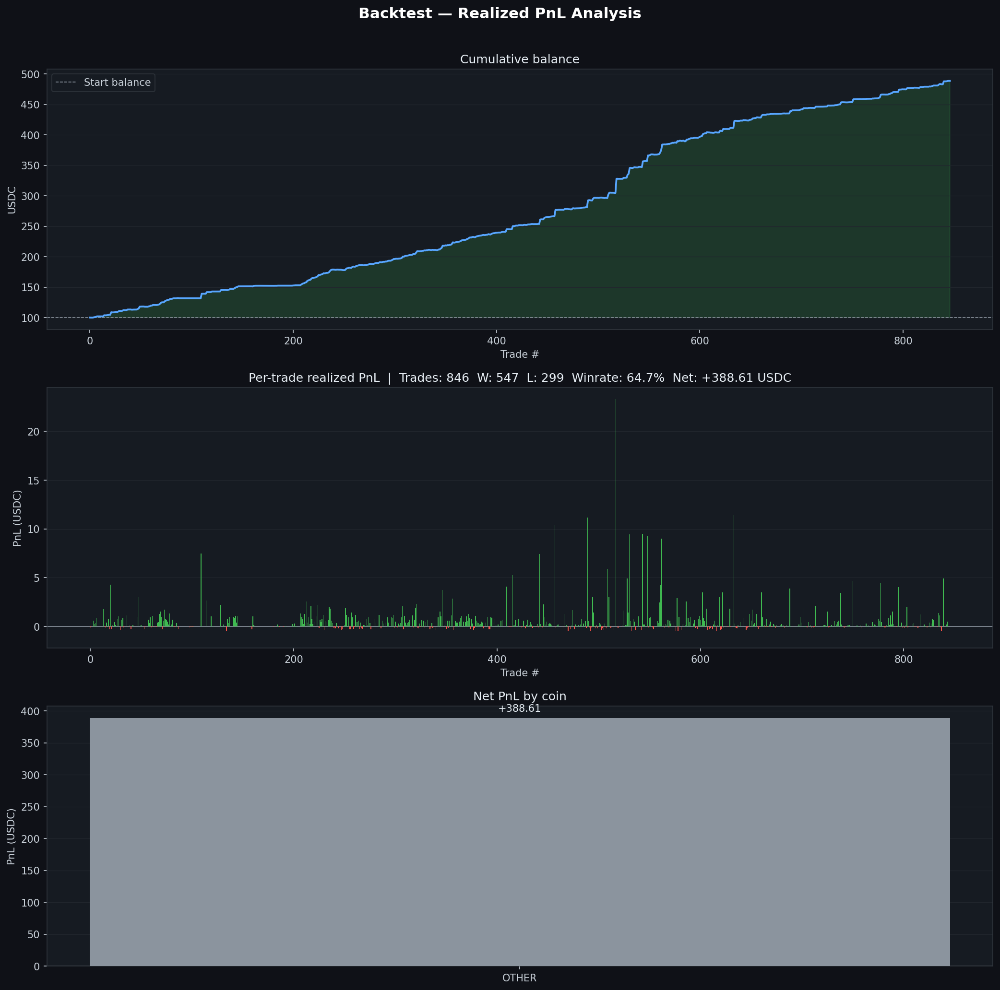
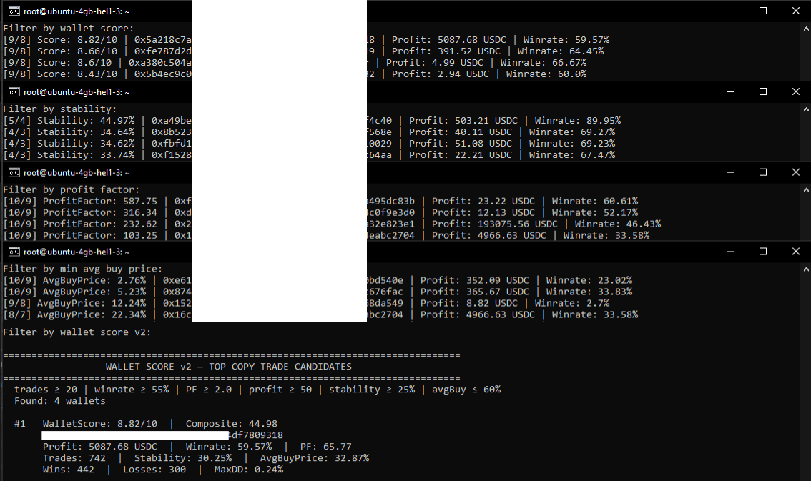

# PolyKiller
## Polymarket copy trading bot faster than polygun.
1. Create venv
2. pip install -r requirements.txt
3. Modify env_example file 
```env
PUBLIC_KEY = ""
PRIVATE_KEY = ""
FUNDER_PUBLIC_KEY = "" # (can be same as PUBLIC_KEY)
POLYGON_RPC = "" # (https://)
POLYGON_WSS = "" # (wss://)
```


4. Rename env_example to .env
5. Run set_allowances.py
6. Run polykiller.py

## To run copy trading
```env
ENABLE_TRADING = true # (enable real trading!)
ONLY_ONE_ORDER = false # (test only)
ENABLE_COPY_TRADE = true # (demo trading)
# Settings
MODE = "FIXED" # FIXED or AUTO
FIXED = 1.0 # (min. 1.0 usdc)
YOUR_MIN = 1.0 # (min. 1.0 usdc)
YOUR_MAX = 2.0 # (usdc)
TRADER_MIN = 10.0 # min. 1.0 usdc
TRADER_MAX = 100.0 # (usdc, enable RUN_BACKTEST_URL to get max value)
MAX_SLIPPAGE = 0.01
ENABLE_BTC = true
ENABLE_ETH = true
ENABLE_SOL = true
ENABLE_XRP = true
ENABLE_DOGE = true
ENABLE_OTHER_MARKETS = true
MIN_TRADER_AMOUNT = 0.01
MAX_DUPLICATE_POSITIONS_TOKEN_ID = 1 (fix spam, 1, 2 or 3 is ok)
MAX_DUPLICATE_POSITIONS_SLUG = 1 (fix spam, 1, 2 or 3 is ok)
BLOCK_SELL_POSITIONS = false (true or false)
USE_LIMIT_ORDERS = false (true or false)
ALLOWED_HOURS= # (empty or 9, 11, 12, 13, 20, 21, ...)
RETRY_COUNT = 5 # (failed orders, no liq.)
```

## To run backtest
```env
RUN_BACKTEST_URL = true
# Settings
BACKTEST_BALANCE = 100 # (demo balance)
BACKTEST_LIMIT = 100 # (how much load trades)
USE_YOUR_AMOUNT_BACKTEST = true # (value from fixed or auto)
USE_WORSE_ENTRY = 0 # (simulate worse entry price)
USE_WORSE_PNL = 0 # (simulate worse pnl)
```


## To find good leaders
```env
RUN_BACKTEST_URL = true # (true, false)
# Settings
AUTO_FIND_BY_LEADBOARD = true # (true, false)
LEADBOARD_CATEGORY = "OVERALL" # (OVERALL, POLITICS, SPORTS, CRYPTO, CULTURE, MENTIONS, WEATHER, ECONOMICS, TECH, FINANCE)
LEADBOARD_TIME_PERIOD = "MONTH" # (DAY, WEEK, MONTH, ALL)
LEADBOARD_LIMIT = 100 # (how much load wallets) 
SKIP_NOT_PROFIT_WALLETS = true # (true, false)
```

## Support me
(Polygon)
```env
0x1a7c2072140bbc569fc6f579db74316d39d64174
```

## Warning
Copy trading is a speculative activity and carries a high risk of financial loss, a trader's past performance does not guarantee future results. Never invest more than you can afford to lose.
